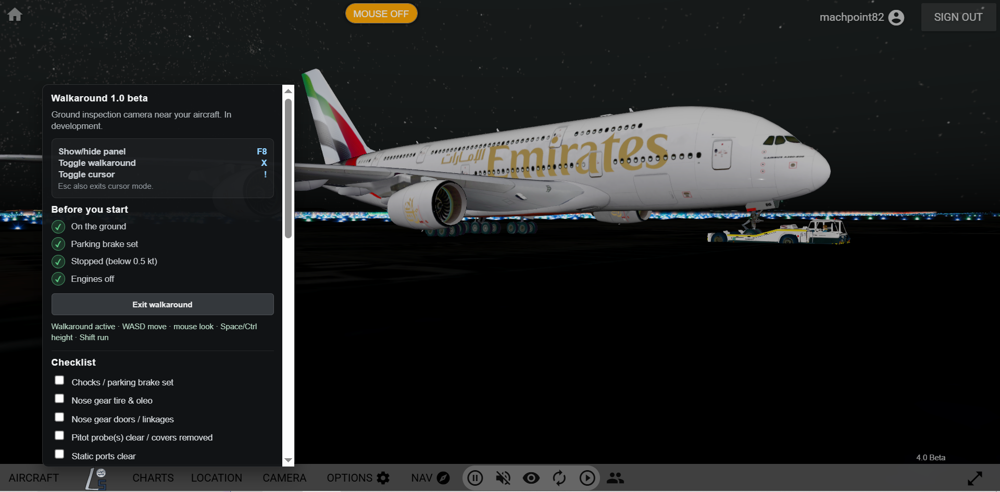
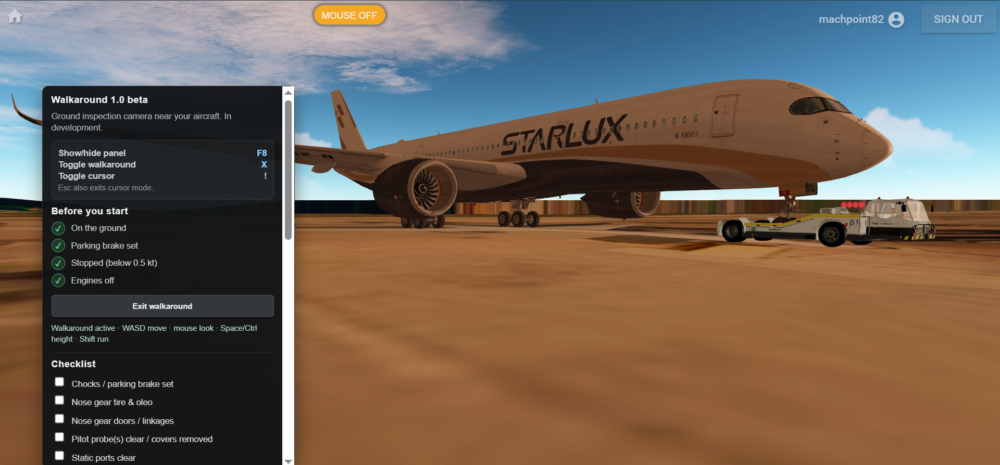

# GeoFS Walkaround

Ground walkaround / pre-flight inspection camera for [GeoFS](https://www.geo-fs.com).

## Due to Academic reasons, do not expect any update till december.

Walk around your aircraft on the ground, inspect parts, run a realistic checklist, and experience a proper pre-flight flow before takeoff.

**Status:** 1.0

## ⚠️ It is likely that you encounter some bugs in GeoFs 4.0 Beta

  
  
  
  
  

  

  

---

## Features

### Safety Gate
Walkaround can only be started when all conditions are met:
- Aircraft is on the ground
- Parking brake is set
- Aircraft is stopped
- Engines are off

### Free Walkaround Camera
- First-person ground camera near the aircraft
- WASD movement
- Mouse look (pointer lock)
- Space / Ctrl / ↑ / ↓ for height
- Shift to run

### Aircraft Part Labels
Look toward different parts of the aircraft and a label appears showing the part name and approximate distance

### Interactive Checklist
Full realistic walkaround checklist covering:
- Chocks / parking brake
- Nose gear, pitot, static ports, probes
- Fuselage, wings, engines, gear, tail
- Leaks and overall skin condition

Items can be checked manually or with a dedicated hotkey that advances to the next unchecked item in order.

### Custom Hotkeys
All important actions are rebindable:
- Toggle walkaround
- Toggle cursor (pointer lock)
- Check next checklist item (optional, no default)

### Settings
Adjustable parameters:
- Walk speed
- Run multiplier
- Vertical speed
- Maximum extra height
- Sound on/off + volume
- All hotkeys

### UI Integration
- Panel appears automatically every session
- You can show/hide the walkaround interface with a custom keyboard key of your choice

## Installation

1. Install a userscript manager:
   - [Tampermonkey](https://www.tampermonkey.net/) (recommended)
   - or Violentmonkey / Greasemonkey

2. [Click here to install](https://raw.githubusercontent.com/machpoint82/GeoFs-Walkaround/main/geofs-walkaround.user.js) or if [this link](https://raw.githubusercontent.com/machpoint82/GeoFs-Walkaround/main/geofs-walkaround.user.js) is not working, copy everything inside, [geofs-walkaround.user.js](geofs-walkaround.user.js) in this repository, go to tampermonkey new userscript tab, delete everything there and paste the contents you copied

---

## How to Use

1. Load any aircraft and place it on the ground.
2. Set parking brake and shut down engines.
4. When all safety lights are green, click **Start walkaround** (or press the walkaround toggle hotkey — default `X` - You can change this in settings).
5. Move around the aircraft, look at parts, and go through the checklist.
6. To show your cursor press `esc` or the default key `!`.To enter look around mode, press `!` again - You can change this in settings
7. Press the walkaround toggle hotkey again (or the Exit button) to leave walkaround mode.

---

## Default Controls

| Action                    | Default Key |
|---------------------------|-------------|
| Toggle walkaround         | `X`         |
| Toggle cursor (pointer lock) | `!`      |
| Move                      | `W` `A` `S` `D` |
| Look                      | Mouse       |
| Up / Down                 | `Space` / `Ctrl` or `↑` / `↓` |
| Run                       | `Shift`     |
| Exit cursor mode          | `Esc`       |

All hotkeys can be changed in **Settings**.

---

## Notes & Limitations

- Part labels use approximate local positions scaled by aircraft size. On very large or unusually shaped aircraft (e.g. A380) some labels may be slightly offset.
- The checklist resets automatically when you change aircraft or move to a significantly different location.

---

**Version:** 1.0
**License:** See [License](LICENSE)

_© 2026_ [machpoint82](https://www.github.com/machpoint82)
